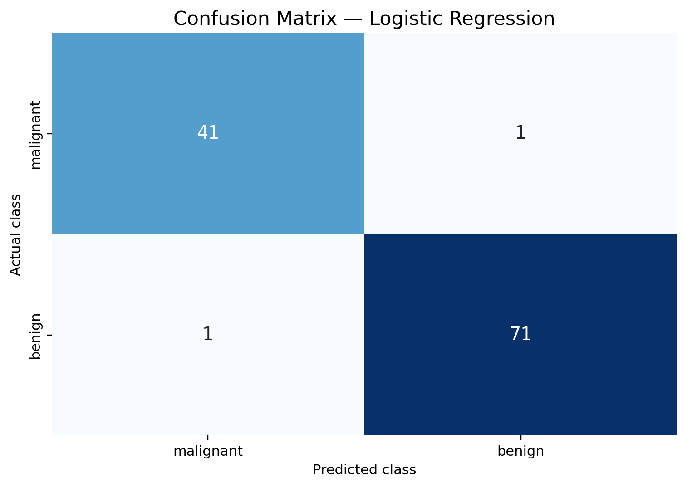
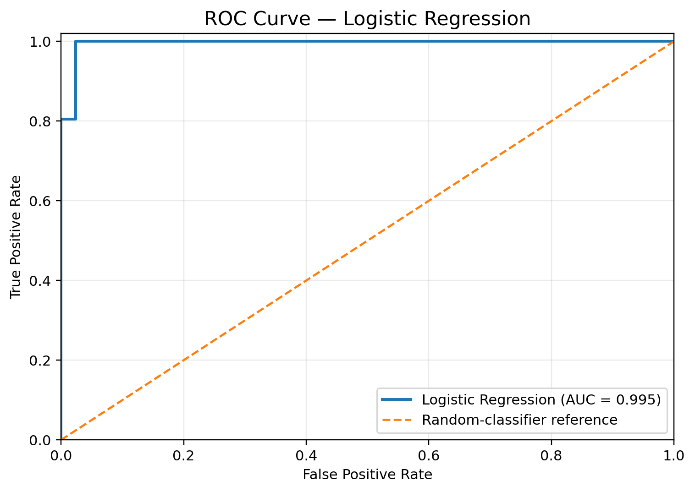

# Week 4: Machine Learning Model Development and Evaluation

## Internship
Virtual Data Science with Python Apprentice Intern

**Organization:** Yuva Intern

## Project Overview
This project develops and evaluates a Logistic Regression model
using the Breast Cancer Wisconsin Diagnostic Dataset.

The objective is to understand the machine learning workflow,
evaluate classification performance, and visualize the results.

## Objectives
- Build a machine learning classification model.
- Split the dataset into training and testing sets.
- Evaluate model performance using classification metrics.
- Visualize the confusion matrix and ROC curve.
- Identify model limitations and suggest improvements.

## Algorithm
Logistic Regression

## Dataset
Breast Cancer Wisconsin Diagnostic Dataset

The dataset is available through Scikit-learn and contains
features computed from digitized images of breast masses.

## Tools and Libraries
- Python
- Scikit-learn
- NumPy
- Matplotlib
- Seaborn

## Model Evaluation
The recorded evaluation results are:

- Accuracy: 98.25%
- Precision: 98.61%
- Recall: 98.61%
- F1-score: 98.61%
- ROC-AUC: 99.54%

These results correspond to the recorded experiment using an
80:20 train-test split and Logistic Regression.

## Visualizations

### Confusion Matrix


### ROC Curve


## How to Run

Install the required libraries:

```bash
pip install scikit-learn matplotlib seaborn numpy
```

Run the Python program:

```bash
python week4_ml_model.py
```

## Project Files
- `week4_ml_model.py` — Python implementation.
- `Week_4_ML_Model_Evaluation_Report.docx` — Detailed project report.
- `Week_4_ML_Model_Evaluation.ipynb` — Jupyter Notebook containing the code, outputs, and visualizations.
- `images/confusion_matrix.png` — Confusion matrix visualization.
- `images/roc_curve.png` — ROC curve visualization.

## Limitations
- Only Logistic Regression was evaluated.
- The experiment used one train-test split.
- External validation and clinical evaluation were not performed.
- The model is for educational purposes only and must not be
  used for medical diagnosis or treatment decisions.

## Future Improvements
- Compare multiple classification algorithms.
- Perform stratified cross-validation.
- Tune hyperparameters.
- Evaluate probability calibration.
- Test on independent datasets.

## Author
M. Srivani


